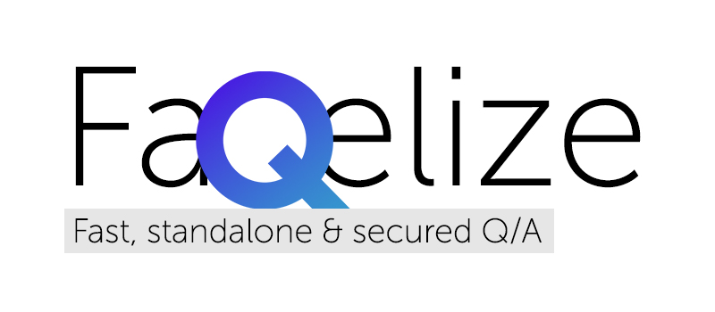

 

🤔 Sometimes it happens that you need to make a FAQ for closed purposes, but you don’t want to install docker or set up a server with a database.  
🖤 Check it out: <a href="https://powerdot.github.io/Faqelize/" target="_blank">Faqelize Demo</a> with password: <code>1234</code>

## Table of Contents
- [Table of Contents](#table-of-contents)
- [Features](#features)
- [Files](#files)
- [First start](#first-start)
- [Configuration file description](#configuration-file-description)
- [How to build](#how-to-build)
- [How to serve build on local server](#how-to-serve-build-on-local-server)
- [Database format](#database-format)
  - [Simple JSON database with questions and answers](#simple-json-database-with-questions-and-answers)
  - [Database with pages](#database-with-pages)
  - [Database with simple answers as html](#database-with-simple-answers-as-html)
- [Database sample](#database-sample)


## Features
* Fully standalone solution
* No need hosting (can be used with [Pages at GitHub](https://pages.github.com/))
* Database encryption with [AES-256](https://en.wikipedia.org/wiki/Advanced_Encryption_Standard)
* Easy to setup without coding
* Easy to change logotype
* Create i18n (2 preinstalled languages: English and Russian)
* Database file can be hosted on dedicated bucket/server
* PWA support
* Flexible: database, password and logotype can be passed as URL parameters

## Files
* Configuration file: `faqelize.config.ts`
* Logotype and PWA App icons: `public/img/*`
* Favicon: `public/favicon.ico`
* FAQ Database: `public/database.json`
* i18n locales: `src/i18n/locales/*`

## First start
* Download this project
* Run <code>npm i</code>
* Create `public/database.json` file with [this sample](#database-sample) content
* Run `npm run dev`
* Go to <a href="http://localhost:8080/" target="_blank">http://localhost:8080/</a> and check the FAQ (`dev` runs without password)  

[Here is](#how-to-build) how to build for production.

## Configuration file description
Prop | Type | Default | Description
--- | --- | --- | --- 
title | string | Faqelize | App title 
database | string | local | Database location.<br/>Can be `local` or any URL<br/>`https://s3.storage.io/db.json`
languages | {code: string; name: string}[] | `[{ code: "ru", name: "Русский" },{ code: "en", name: "English" }]` | List of languages located in `src/i18n/locales/*`
defaultLanguage | string | ru | Default language.<br/>Preinstalled languages: `en` (English), `ru` (Russian)
showLanguageSwitcher | boolean | true | Display language switcher
usePins | boolean | true | Enable pins for questions
savePassword | boolean | true | Autosave password hash in LocalStorage
encryptDatabase | boolean | true | Encrypt database.json with password while building
installAsPWA | boolean | true | Suggest installing as app on mobile devices
disableLogoutOnStandalone | boolean | true | Disable logout if page works as PWA on smartphone
logo | string/boolean |  | Set logotype image.<br>If string is empty - default logo from ./public/img/logo.png<br>If string is not empty - image from string (URL or base64)<br>If bool is true - default logo from ./public/img/logo.png<br>If bool is false - no logo
productionPublicPath | string | /Faqelize/ | Public path for production build
acceptPasswordParameter | boolean | true | Accept login by `&password` URL parameter.<br>! Can be insecure.<br>*However, if you use it, better send sha256 password hash instead of raw password.*
passwordParameterKey | string | password | Password URL parameter key
clearPasswordParameter | boolean | true | Clear password URL parameter after login
acceptLogoParameter | boolean | true | Accept logo by `&logo` URL parameter.<br>! Can be insecure for XSS.
logoParameterKey | string | logo | Logo URL parameter key
acceptDatabaseParameter | boolean | true | Accept database by `&database` URL parameter.<br>! Can be insecure for XSS.
databaseParameterKey | string | db | Database URL parameter key
displayPageIcon | boolean | true | Display or hide icon of "page" type of answer
answerPageOpeningAnimation | boolean | false | Animate opening for answer page


## How to build
* Create `public/database.json` file with [this sample](#database-sample) content *(if you don't have it)*
* Check `encryptDatabase` (in `faqelize.config.js`) parameter to define password encryption before building
* Run `npm run build`
* *(optional)* If `encryptDatabase` is `true`, you need to enter password to encrypt database
* Your FAQ is ready to use in `./docs` folder 🎉

Now you can deploy it on GitHub Pages or any other hosting.

## How to serve build on local server
* Run `npm run serve`

## Database format

### Simple JSON database with questions and answers

```json
[
    {
        "id": 1,
        "q": "What is your name?",
        "a_text": "My name is Ilya."
    }
]
```

### Database with pages

```json
[
    {
        "id": 2,
        "q": "What is JSON dictionary?",
        "a_page": {
            "page": "JSON_dict",
            "subText": "All about Dictionaries for Faqelize."
        }
    }
]
```
* `page` option is a name of component at `./src/pages/`

### Database with simple answers as html

```json
[
    {
        "id": 3,
        "q": "What is HTML?",
        "a_html": {
            "html": "<h1>HTML</h1><p>HTML is a markup language used to create web pages.</p>"
        }
    }
]
```

## Database sample
```json
[
    {
        "id": "what_is_faqelize",
        "q": "What is Faqelize?",
        "a_text": "It's a simple client for JSON dictionaries that's support encryption for private usage. It's also a simple way to create a simple FAQ for your website."
    },
    {
        "id": "what_is_json_dict",
        "q": "What is JSON dictionary?",
        "a_page": {
            "page": "JSON_dict",
            "subText": "All about Dictionaries for Faqelize."
        }
    },
    {
        "id": "where_to_config",
        "q": "Where to configure Faqelize?",
        "a_html": {
            "html": "In <b>./faqelize.config.js</b> file!"
        }
    },
    {
        "id": "developer",
        "q": "Who is the developer?",
        "a_html": {
            "html": "GitHub <a href='https://github.com/powerdot' target='_blank'>@powerdot</a> 😎"
        }
    },
    {
        "id": "encryption",
        "q": "What kind of encryption is used?",
        "a_text": "AES256, bro"
    },
    {
        "id": "pinned",
        "q": "Where are you store pinned questions?",
        "a_text": "In localStorage localy in your browser. Only question ids."
    },
    {
        "id": "lost_password",
        "q": "I lost password from database.json",
        "a_text": "Sorry, here is no way to recover it. You can create a new database.json file and use it. AES256 is used for encryption and it's too strong."
    },
    {
        "id": "searching",
        "q": "What search engine is used?",
        "a_text": "Here is MiniSearch. It's a simple search engine for JSON dictionaries."
    }
]
```